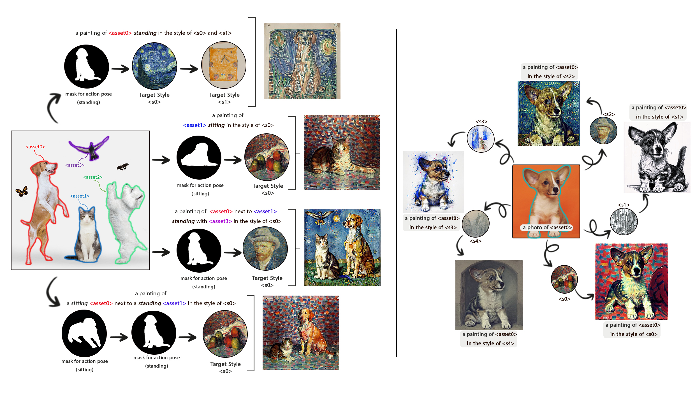

# MCGM-Styler

Official repository for *MCGM-styler: Free-Form styler for Mask Conditional Text-to-Image Generative Model*




## 🧠 Paper
**Title:** "Free-Form styler for Mask Conditional Text-to-Image Generative Modele"  
**Authors:** Rami Skaik, Leonardo Rossi, Tomaso Fontanini, and Andrea Prati  
**Publication:** The Visual Computer -2025 
**Paper:** [Download Paper (PDF)](paper.pdf)


## 💻 Abstract
MCGM-Styler is a generative model for text-to-image synthesis that combines pose control and artistic style transfer. It can generate images in specific poses and styles using only a single training image, making it efficient and adaptable.

## ⚙️ Installation
```bash
conda env create -f environment.yml
conda activate MCGM_Styler
conda install pytorch==1.13.1 torchvision==0.14.1 torchaudio==0.13.1 pytorch-cuda=11.7 -c pytorch -c nvidia

### ⚙️ Training
```bash
python train.py \
  --instance_data_dir","examples/mask_path",
  "--num_of_assets","1",
  "--initializer_tokens","building",
  "--class_data_dir","ENTER THE PATH OF THE CLASS OUTPUT IMAGES FOLDER",
  "--phase1_train_steps","400",
  "--phase2_train_steps","400",
  "--output_dir","ENTER THE PATHE OF YOURE OUTPUT FOLDER",
  "--sample_batch_size", "1",
  "--num_class_images", "1",
  "--with_mask_encoder",
  "--with_style_encoder",
  "--with_cross_att_on_mask",
  "--lambda_attention","0", //style without attention
  "--pretrained_model_name_or_path","ENTER THE PATHE OF THE MODEL",
  "--do_not_apply_masked_loss", 
  "--token_prompt","ENTER THE PROMPT OF THE IMAGE STYLE DESCRIPTION (HUMAN FEEDBACK PROMPT)",


